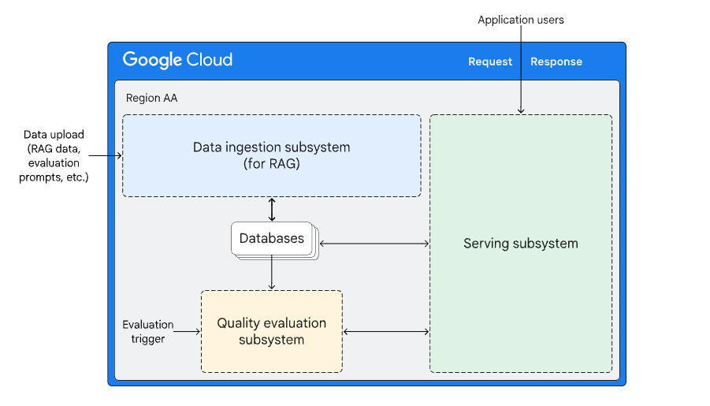

# **Retrieval-Augmented Generative AI Q&A Solution for Food Safety**

## **Project Overview**

This project is a demonstration of a real-world Generative AI Question & Answer (Q&A) solution using a Retrieval-Augmented Generation (RAG) framework. The application allows users, specifically employees of **Cymbal Shops**, to ask questions about food safety guidelines, and receives accurate answers based on the **New York City Department of Health and Mental Hygiene's Food Protection Training Manual**.

The solution leverages the following technologies and services:

- **Google Cloud Platform (GCP)**
  - **Vertex AI**: For generating embeddings and leveraging generative AI models.
  - **Firestore**: Used as a vector database to store document embeddings and perform vector similarity searches.
  - **Cloud Run**: For deploying the Flask application.
  - **Artifact Registry**: For storing Docker images.

- **Python Libraries**
  - **LangChain**: For document loading, processing, and chunking.
  - **PyMuPDF**: For parsing PDF documents.
  - **Flask**: For building the web application.

## **Table of Contents**

- [Project Overview](#project-overview)
- [Features](#features)
- [Architecture](#architecture)
- [Setup and Installation](#setup-and-installation)
- [Usage](#usage)
- [Project Structure](#project-structure)
- [Key Functions and Code Snippets](#key-functions-and-code-snippets)
- [Deployment](#deployment)
- [Testing the Application](#testing-the-application)
- [Conclusion](#conclusion)
- [References](#references)

## **Features**

- **Document Ingestion and Processing**: Downloads and processes the NYC Food Safety Manual, splitting it into semantically meaningful chunks.
- **Embedding Generation**: Generates embeddings for each text chunk using Vertex AI's embedding models.
- **Vector Database Creation**: Stores text chunks and embeddings in Firestore with vector indexing for efficient similarity search.
- **Retrieval-Augmented Generation**: Implements a function to search the vector database and retrieve relevant context based on user queries.
- **Generative AI Integration**: Uses Vertex AI's generative models (Gemini) to generate answers based on retrieved context.
- **Web Interface**: Provides a Flask web application for users to interact with the Q&A system.
- **Cloud Deployment**: Deploys the application to Cloud Run for scalable and serverless hosting.

## **Architecture**

 <!-- Include an architecture diagram if available -->

The application follows these steps:

1. **Data Preparation**: Load and preprocess the PDF document, splitting it into chunks.
2. **Embedding Generation**: Generate embeddings for each chunk using Vertex AI.
3. **Vector Database Creation**: Store chunks and embeddings in Firestore with vector indexing.
4. **Query Processing**:
   - User submits a question via the web interface.
   - The application generates an embedding for the query.
   - Performs a vector search in Firestore to retrieve relevant chunks.
5. **Answer Generation**: Uses the retrieved context to generate an answer using the generative AI model.
6. **Response Delivery**: Presents the answer to the user through the web interface.

## **Setup and Installation**

### **Prerequisites**

- **Google Cloud Platform Account** with the following services enabled:
  - Vertex AI
  - Firestore
  - Cloud Run
  - Artifact Registry
- **Google Cloud SDK** installed locally or access to **Cloud Shell**.
- **Python 3.7+**

### **Clone the Repository**

```bash
git clone https://github.com/your-username/your-repo-name.git
cd your-repo-name
```

### **Install Required Libraries**

```bash
pip install -r requirements.txt
```

### **Set Up Environment Variables**

Create a `.env` file in the project root directory and add your Google Cloud project configurations:

```env
PROJECT_ID=your-google-cloud-project-id
LOCATION=us-central1
```

## **Usage**

### **1. Data Preparation and Embedding Generation**

**Download the NYC Food Safety Manual:**

```bash
gsutil cp gs://partner-genai-bucket/genai069/nyc_food_safety_manual.pdf .
```

**Process and Clean the PDF Content:**

```python
from langchain_community.document_loaders import PyMuPDFLoader

loader = PyMuPDFLoader("nyc_food_safety_manual.pdf")
data = loader.load()
```

**Clean the Pages:**

```python
def clean_page(page):
    return page.page_content.replace("-\n","")\
                            .replace("\n"," ")\
                            .replace("\x02","")\
                            .replace("\x03","")\
                            .replace("fo d P R O T E C T I O N  T R A I N I N G  M A N U A L","")\
                            .replace("N E W  Y O R K  C I T Y  D E P A R T M E N T  O F  H E A L T H  &  M E N T A L  H Y G I E N E","")

cleaned_pages = [clean_page(page) for page in data]
```

**Split into Chunks Using SemanticChunker:**

```python
from langchain_experimental.text_splitter import SemanticChunker
from langchain_google_vertexai import VertexAIEmbeddings

embedding_model = VertexAIEmbeddings(model_name="textembedding-gecko@001")
chunker = SemanticChunker(embedding_model=embedding_model, chunk_size=500, overlap=50)
documents = [Document(page_content=page) for page in cleaned_pages]
chunked_documents = chunker.split_documents(documents)
chunked_content = [doc.page_content for doc in chunked_documents]
```

**Generate Embeddings:**

```python
chunked_embeddings = embedding_model.embed_documents(chunked_content)
```

### **2. Create the Vector Database in Firestore**

**Initialize Firestore Client:**

```python
from google.cloud import firestore

db = firestore.Client()
collection = db.collection('food-safety')
```

**Store Chunks and Embeddings:**

```python
from google.cloud.firestore_v1.vector import Vector

for content, embedding in zip(chunked_content, chunked_embeddings):
    doc_ref = collection.document()
    doc_ref.set({
        'content': content,
        'embedding': Vector(embedding)
    })
```

**Create a Vector Index:**

Use the following `gcloud` command to create the vector index:

```bash
gcloud firestore indexes composite create \
  --project='your-project-id' \
  --collection-group='food-safety' \
  --query-scope=COLLECTION \
  --field-config=field-path=embedding,vector-config='{"dimension":"768", "flat": "{}"}' \
  --database='(default)'
```

### **3. Implement the Retrieval Function**

```python
def search_vector_database(query: str):
    context = ""
    query_embedding = embedding_model.embed_query(query)
    results = collection.find_nearest(
        field_path='embedding',
        vector=Vector(query_embedding),
        limit=5,
        distance_measure=DistanceMeasure.COSINE
    ).get()
    for doc in results:
        doc_dict = doc.to_dict()
        context += doc_dict.get('content', '') + "\n"
    return context
```

### **4. Integrate the Generative AI Model**

**Instantiate the Generative Model:**

```python
from vertexai.generative_models import GenerativeModel

gen_model = GenerativeModel.from_pretrained("gemini-pro")
```

**Create the Function to Generate Answers:**

```python
def ask_gemini(question):
    prompt_template = (
        "Answer the following question based on the provided context.\n\n"
        "Context:\n{context}\n\n"
        "Question:\n{question}\n\n"
        "Answer:"
    )
    context = search_vector_database(question)
    prompt = prompt_template.format(context=context, question=question)
    safety_settings = [
        {
            "category": "harm",
            "threshold": "HIGH"
        }
    ]
    response = gen_model.predict(
        prompt,
        temperature=0.0,
        safety_settings=safety_settings
    )
    return response.text
```

### **5. Run the Flask Application Locally**

**Start the Flask App:**

```bash
python3 main.py
```

**Access the Application:**

- Open your web browser and navigate to `http://localhost:8080`.
- Ask questions to FreshBot and receive answers.

## **Project Structure**

```
├── gen-ai-assessment
│   ├── main.py
│   ├── requirements.txt
│   ├── Dockerfile
│   ├── templates
│   │   └── index.html
│   └── static
│       └── styles.css
├── README.md
└── .env
```

- **main.py**: The main Flask application file.
- **requirements.txt**: Contains the Python dependencies.
- **Dockerfile**: Used to containerize the application.
- **templates/**: Contains HTML templates for the web interface.
- **static/**: Contains static assets like CSS files.

## **Key Functions and Code Snippets**

### **1. search_vector_database**

Retrieves relevant context from the vector database based on the user's query.

### **2. ask_gemini**

Generates an answer using the generative AI model, given the user's question and retrieved context.

### **3. Flask Routes**

- **`/`**: The home route that renders the web interface.
- **`/ask`**: Handles POST requests with the user's question and returns the generated answer.

## **Deployment**

### **1. Build and Push the Docker Image**

**Build the Docker Image:**

```bash
docker build -t cymbal-docker-image -f Dockerfile .
```

**Tag and Push the Image to Artifact Registry:**

```bash
docker tag cymbal-docker-image:latest us-central1-docker.pkg.dev/your-project-id/cymbal-repo/cymbal-docker-image:latest
gcloud auth configure-docker us-central1-docker.pkg.dev
docker push us-central1-docker.pkg.dev/your-project-id/cymbal-repo/cymbal-docker-image:latest
```

### **2. Deploy to Cloud Run**

**Deploy the Service:**

```bash
gcloud run deploy cymbal-freshbot \
  --image us-central1-docker.pkg.dev/your-project-id/cymbal-repo/cymbal-docker-image:latest \
  --platform managed \
  --region us-central1 \
  --allow-unauthenticated
```

**Set Permissions:**

- Ensure the Cloud Run service account has the following roles:
  - **Cloud Datastore User** (`roles/datastore.user`)
  - **Vertex AI User** (`roles/aiplatform.user`)

## **Testing the Application**

**Access the Cloud Run Service URL:**

- After deployment, access the service URL provided by Cloud Run.

**Ask FreshBot a Question:**

Example question:

```
How should smoked fish be stored?
```

**Expected Answer:**

```
Smoked fish should be stored at or below 38°F (3.3°C) to prevent the growth of harmful bacteria like Clostridium botulinum. It's important to keep smoked fish refrigerated and consume it before the expiration date.
```

## **Conclusion**

This project demonstrates the integration of multiple Google Cloud services to create a powerful, context-aware Q&A application. By leveraging Firestore's vector search capabilities and Vertex AI's generative models, the application provides accurate and relevant answers based on authoritative documents. The deployment to Cloud Run ensures scalability and accessibility, making it a robust solution for real-world applications.

## **References**

- [Vertex AI Documentation](https://cloud.google.com/vertex-ai/docs)
- [Firestore Vector Search](https://cloud.google.com/firestore/docs/vector-search)
- [LangChain Documentation](https://python.langchain.com/)
- [PyMuPDF Documentation](https://pymupdf.readthedocs.io/)
- [Flask Documentation](https://flask.palletsprojects.com/)
- [Cloud Run Documentation](https://cloud.google.com/run/docs)
- [Artifact Registry Documentation](https://cloud.google.com/artifact-registry/docs)

---

Feel free to clone this repository and experiment with the code. Contributions and suggestions are welcome!
